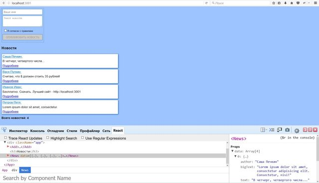

### Добавление новостей

#### React.js для начинающих:

* react
* react-dom
* express
* EventEmitter

#### Основные возможности
Приложение новостей, в котором можно добавить новость, а так же посмотреть у новости "подробнее".

* компоненты, propTypes
* props и state компонента
* работа с формой
* работа с react dev tools

#### Установка и настройка
* *git clone* https://bitbucket.org/stasok/react-simple - **скопируйте репозиторий к себе**
* *cd react-simple* - **перейдите в папку с проектом**
* *npm i*  - **установите зависимости**
* *npm start* - **старт приложения по адресу http://localhost:3001/**

#### Получить помощь
https://bitbucket.org/stasok/react-simple/pull-requests/ - принимаю пожелания и замечания.

#### Смотрите также
* [Лицензия](./license.md)
